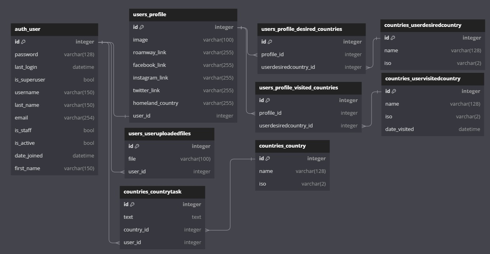

[]

# Django проект RoamWay

## ER-Диаграмма
Изображение ER-диаграммы для БД находится в файле ER.jpg


## Установка
Для запуска проекта требуется:

1. Клонирование репозитория:
    ```
    git clone git@gitlab.crja72.ru:django_2023/projects/46134-danyvd-command-4.git
    ```
2. Создание виртуальной среды:
    ```
    python -m venv venv
    ```
3. Активация виртуальной среды:
    ```
    source venv/bin/activate
    ```
4. Установка необходимых зависимостей:
    ```
    pip install -r requirements/prod.txt
    ```
    1. Установить дополнительно к необходимым зависимостям, если требуется тестирование проекта:
        ```
        pip install -r requirements/test.txt
        ```
    2. Установить дополнительно к необходимым зависимостям, если требуется внести изменения в проект (разработка):
        ```
        pip install -r requirements/dev.txt
        ```
5. Создание файла ".env" для секретных данных и конфигурации (заполнить все поля в данном файле **обязательно**):
```
cp .env.example .env
```
6. Переход в директорию **RoamWay** для создания БД и запуска сервера:
```
cd RoamWay
```
7. Создание БД (с учетом миграций):
```
python manage.py migrate
```
8. Загрузка фикстуры:
```
python manage.py loaddata fixtures/data.json
```
9. Запуск сервера:
```
python manage.py runserver
```
10. Для разработки следует установить гит-хуки flake8 и black с помощью pre-commit (на месте pre-commit - путь до pre-commit.exe)
```
pre-commit install
```

## Создание перевода
Для создания индивидуального перевода требуется:
1. Открыть файл **settings.py** и в поле *LANGUAGES* добавить свой язык в формате:
```
LANGUAGES = (
    ("ru", _("Russian")),
    ("en", _("English")),
    ("<код_языка>", _("<полное_название>"))
)
```
На примере французского:
```
("fr", _("French"))
```
2. В консоли перейти из главной директории в **RoamWay**:
```
cd RoamWay
```
3. Создать файл с переводом для требуемого языка:
```
django-admin makemessages -l <код_языка>
```
На примере французского:
```
django-admin makemessages -l fr
```
4. Перейти в каталог с файлом перевода.
```
locale/<код_языка>/LC_MESSAGES/django.po
```
5. Открыть данный файл. В файле отредактировать все поля с переводом текста (**msgstr**).
Пример:
```
#: templates/index.html:10
msgid "Welcome to our website." // оригинал
msgstr "Bienvenido a nuestro sitio web." // перевод
```
6. После всех внесенных изменений - сохранить файл. Произвести **компиляцию** файла:
```
django-admin compilemessages
```
7. Переключиться на созданный перевод в файле **settings.py**:
```
LANGUAGE_CODE = "<код_языка>"
```